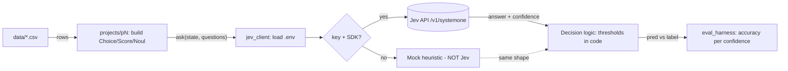

# Jev practice lab

Hands-on projects for TypeSafe Jev (System One model). See `docs/JEV_QUICK_REFERENCE.md`.

## Setup
```bash
python3 -m venv .venv && source .venv/bin/activate
pip install -r requirements.txt
export TYPESAFE_API_KEY="sk-..."   # optional: without it everything runs in MOCK mode
```
**MOCK mode** (no key) uses a word-overlap heuristic with the same response shape. Use it to build
and debug pipeline logic. Its accuracy numbers are meaningless; get early access at https://typesafe.ai.

## Projects (easiest first) — run from this folder
| # | Command | Primitive / pattern | Skill you practice |
|---|---|---|---|
| 1 | `python3 -m projects.p1_ticket_triage` | Choice + Noul, one call | Multi-question calls, routing |
| 2 | `python3 -m projects.p2_log_severity` | Score | Writing ordered rubrics |
| 3 | `python3 -m projects.p3_cli_risk_gate` | Noul + thresholds | Agent guardrails; "dangerous misses" must be 0 |
| 4 | `python3 -m projects.p4_llm_output_grader` | Score + Noul, composite | Cheap LLM-as-judge |
| 5 | `python3 -m projects.p5_confidence_router` | Choice + confidence gating | Auto / LLM / human routing |

Each prints accuracy **and accuracy per confidence bucket** (`eval_harness.py`). With the real Jev,
check that the high-confidence bucket is actually the most accurate. Then tune thresholds.

## Exercises
1. Edit the `criteria` text, re-run, and watch accuracy change (prompting for a classifier).
2. Add 30 of your own rows to a CSV (real tickets/logs, scrubbed of customer data).
3. P3: tune thresholds until dangerous misses = 0, then count how many safe commands you now block.
4. P5: plug a real LLM (e.g. Claude) into the "LLM (reasoning)" lane.
5. Benchmark: run the same classification through an LLM and through Jev. Compare latency, cost and accuracy.

## How it works
Interactive diagram: open `docs/project_flow.html` in a browser (source: `docs/project_flow.workflow.json`).



## Running
Always run from this folder as a module: `python -m projects.p1_ticket_triage`
(not `python projects/p1_ticket_triage.py` — that breaks the `jev_client` / `eval_harness` imports).
